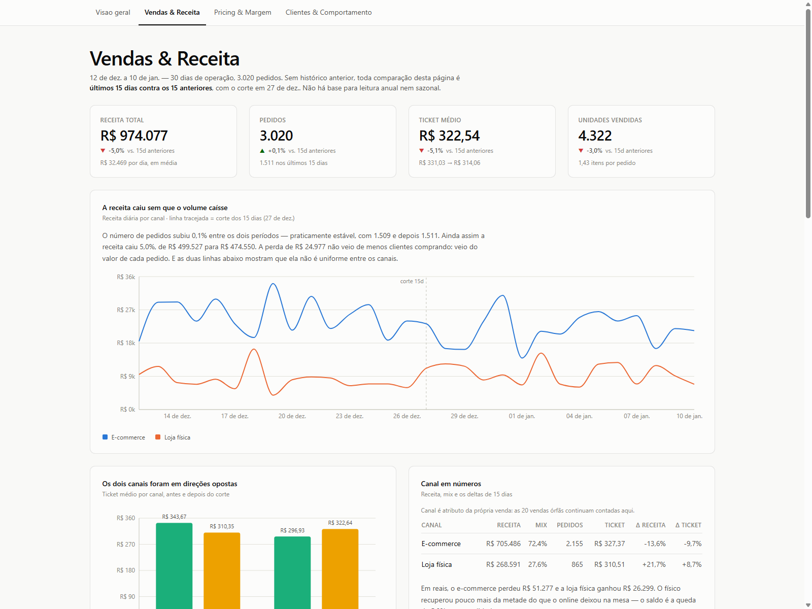
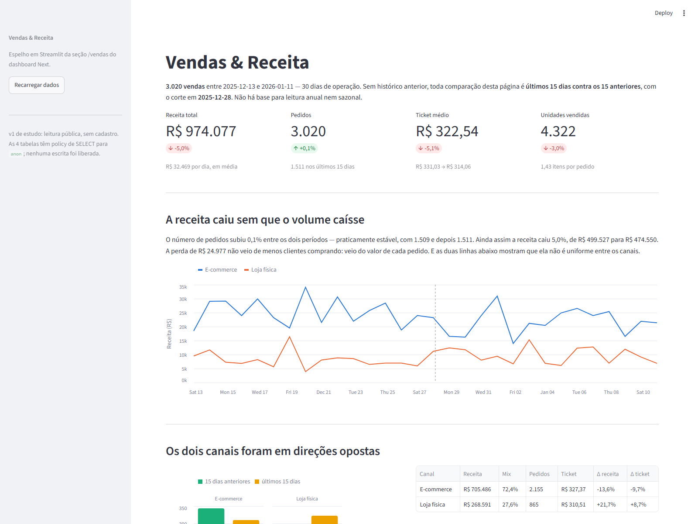

# Dashboard de Ecommerce — Next.js + Supabase

Dashboard analítico de **Vendas**, **Pricing** e **Clientes** sobre uma base de
ecommerce em Postgres (Supabase). Cada seção conta uma história de negócio com
começo, tensão e recomendação — não é uma parede de números.

**Base:** 30 dias (2025-12-13 a 2026-01-11) · 3.020 vendas · R$ 974.077,28 de
receita · 215 produtos · 50 clientes · 4 concorrentes monitorados.

```bash
npm install && npm run dev     # http://localhost:3000
npm test                       # typecheck + 195 testes
```



> Seção **Vendas & Receita**: KPIs com delta de 15 dias, receita diária por canal
> com o corte marcado, e a leitura de negócio escrita ao lado do gráfico — não
> abaixo dele.

---

## O que este projeto demonstra

| Competência | Onde aparece |
|---|---|
| **Modelagem analítica de negócio** | 40+ KPIs com fórmula e fonte de dados documentadas no próprio código |
| **SQL e diagnóstico de dados** | Descoberta de FK inválida, dado sintético plantado, política de desconto em degraus e migração de canal — tudo via query, não suposição |
| **Arquitetura front-end** | Next.js App Router, fronteira server/client explícita, funções puras separadas da renderização |
| **Design de visualização** | Paleta validada para daltonismo, tema claro/escuro, proibição de eixo duplo, legenda e tabela alternativa em todo gráfico |
| **Engenharia de qualidade** | 195 testes, typecheck no portão de teste, smoke test HTTP em build de produção, cruzamento dos números com SQL |
| **Segurança** | Auditoria de RLS, separação de chaves pública/secreta, correção de regex de middleware |
| **Comunicação técnica** | 6 documentos de decisão + contrato de arquitetura versionado |

---

## Quatro achados que mudam decisão de negócio

O valor de um dashboard não é exibir dados — é mudar o que alguém faz na
segunda-feira.

### 1. O valor migrou do online para a loja — e não foi desconto

Na segunda metade da janela, a receita do ecommerce caiu **13,6%** enquanto a da
loja física subiu **21,7%**. As compras por cliente ficaram estáveis (30,2 nas
duas metades), então não foi retração de demanda.

A hipótese óbvia era erosão de desconto no site. **Foi testada e derrubada:** o
desconto médio ficou plano em ~9% nos dois canais. A causa real é **mix de
produto** — o preço de tabela médio do que vendeu online caiu de R$ 256,25 para
R$ 231,54 e o da loja subiu de R$ 212,80 para R$ 231,67. A decomposição fecha sem
resíduo: dos −R$ 23,69 de preço médio no ecommerce, −R$ 23,90 vêm de mix e
+R$ 0,21 de desconto.

> **Recomendação:** não gastar verba de desconto para defender o share online.
> Migração de catálogo entre canais é decisão de sortimento e logística, não de
> pricing.

### 2. O desconto não é negociado — é um botão de três posições

**As 1.159 linhas descontadas saem em exatamente 5%, 10% ou 15%.** Nenhum valor
intermediário. Isso não é negociação caso a caso: é política comercial com
opções predefinidas.

Essa descoberta muda a natureza da recomendação. Não é "descontem menos", que
ninguém sabe executar — é **desligar o degrau de 15%, que sozinho custa
R$ 15.198 em 30 dias**.

### 3. Desconto não compra volume nesta base

Unidades por linha de venda: **1,424** sem desconto contra **1,479** na faixa de
15%. A curva é plana. A erosão total de **R$ 31.780 em 30 dias** não tem
contrapartida mensurável em volume.

Bônus do mesmo recorte: **136 linhas saíram acima do preço de tabela**
(+R$ 4.645). O preço de tabela não está sendo respeitado nem como teto nem como
piso.

### 4. Uma categoria inteira é dado sintético

A categoria **Tênis** tem os 4 concorrentes cotando **exatamente o mesmo preço**,
sempre metade do nosso, nos 15 produtos — e zero vendas. Isso é assinatura de
dado gerado, não posição de mercado.

Sem isolar esses 15 produtos, o dashboard reportaria *"estamos 7,7% acima do
mercado"* quando a mediana real do catálogo é **1,01**. Seria uma mentira num KPI
de capa. O código os exclui das recomendações de reprecificação e marca a
categoria como suspeita na tela.

---

## Decisões de engenharia que valem explicação

**Sem coluna de custo, margem não é inventada.** A base não tem custo em nenhuma
tabela, então margem contábil é incalculável. Em vez de assumir um percentual e
apresentá-lo como real, a seção de Pricing trabalha com *proxy competitivo* e
*erosão de desconto* — tudo rastreável a dado que existe.

**Duas métricas com o mesmo nome causaram a única divergência real do projeto.**
"Realização de preço" pode ser a média simples por linha ou a ponderada por
receita. Elas concordam no total (96,89% vs. 96,83%) e **divergem 0,7 pp na loja
física** — porque a loja mudou o *alvo* do desconto: passou a descontar o item
caro (tabela média das linhas descontadas subiu de R$ 196,02 para R$ 240,10). A
ponderada enxerga isso; a simples não. A solução não foi escolher a mais simples,
foi **dar nome às duas** e rotular qual está na tela.

**Integridade quebrada tratada por regra única.** A FK `vendas_id_produto_fkey`
está `NOT VALID` no banco: 20 vendas apontam para produtos inexistentes. A regra
compartilhada é que elas **contam na receita total** (a venda aconteceu) e **saem
de qualquer corte por produto** (não há atributo para classificá-las). Por isso a
receita total e a soma das categorias **não fecham de propósito**, com a
diferença declarada em nota de rodapé.

**Falhar alto em vez de mostrar zeros.** A RLS do Postgres não rejeita quem não
pode ler — ela responde *200 com lista vazia*. Um dashboard ingênuo renderizaria
zeros, indistinguível de um negócio parado. O `getDataset()` lança erro
explicativo quando a leitura volta vazia.

**Ponto flutuante quebrou um binning e a recomendação junto.** Como todo desconto
é 5%, 10% ou 15%, cortar as faixas exatamente nesses limites colocava o volume
inteiro em cima da fronteira — e `1 - 90/100` dá `0.09999999999999998`, então um
desconto de 10% escorregava para a faixa de baixo em JavaScript enquanto o mesmo
dado em SQL ficava na de cima. O `<Insight>` recomendava cortar a faixa errada
com o valor errado. Nenhum dos testes pegava, porque todos comparavam a
implementação com ela mesma; **só o cruzamento com SQL expôs**.

**Teste verde não é prova de que funciona.** O typecheck passava, os testes
passavam e o `next build` compilava — e mesmo assim `/pricing` devolvia
**HTTP 500** em produção, por passar uma função de um Server Component para um
Client Component. Só apareceu ao servir a página. Por isso a verificação final é
smoke test HTTP em build de produção mais conferência dos números contra SQL, não
só a suíte.

---

## Arquitetura

```
src/
  app/
    layout.tsx                 raiz: tema claro/escuro, globals
    login/page.tsx             autenticação e-mail + senha (preservada)
    (dashboard)/
      layout.tsx               navegação e moldura
      page.tsx                 visão geral executiva
      error.tsx                estado de erro com diagnóstico acionável
      vendas/ pricing/ clientes/
        page.tsx               Server Component: busca + orquestra
        _components/*.tsx      gráficos 'use client', dados já agregados
  components/
    ui/                        Card, KpiTile, Insight, Legend, DataTable, Nav
    charts/                    gráficos compartilhados
  lib/
    supabase/                  clientes server e browser (@supabase/ssr)
    data/
      types.ts                 tipos espelhando o esquema real
      fetch.ts                 getDataset(): 4 tabelas, paginadas, cache por request
      regras.ts                receita, período, órfãs, agrupamentos — regra única
    design/
      tokens.ts                paleta, tipografia, espaçamento, specs de marca
      chart-theme.ts           tema Recharts
      format.ts                formatadores pt-BR
    kpi/                       funções puras por seção — é o que os testes cobrem
  middleware.ts                renovação de sessão
tests/                         195 testes Vitest
docs/                          6 documentos de decisão
CONTRATO.md                    contrato de design e propriedade de arquivos
```

**O padrão que sustenta a testabilidade:** cada seção entrega dois artefatos
separados — `src/lib/kpi/<seção>.ts` com funções **puras** (sem React, sem fetch,
sem relógio) e `page.tsx` como Server Component que só orquestra. Toda a lógica
de negócio fica testável sem montar um componente.

Toda função de KPI carrega fórmula e fonte no docblock:

```ts
/**
 * Ticket médio.
 * Fórmula: receita_total / nº de pedidos distintos
 * Fonte: vendas.quantidade * vendas.preco_unitario, vendas.id_venda
 */
```

### Sistema de design

Paleta de 8 slots em ordem fixa, validada para deficiência de visão de cores em
modo claro e escuro. Regras aplicadas em todos os gráficos:

- **Cor segue a entidade, nunca o ranking** — um filtro que muda a contagem de
  séries não repinta as sobreviventes.
- **Nunca eixo duplo.** Duas escalas diferentes → dois gráficos.
- **Teto de séries:** 8 em barra/linha, 3 em scatter. Acima disso, "Outros" —
  nunca um nono matiz gerado.
- **Sequencial** = um matiz claro→escuro. **Divergente** = azul↔vermelho com
  cinza neutro no meio. **Status** é reservado e sempre vem com ícone + rótulo,
  nunca cor sozinha.
- Legenda para ≥2 séries, tabela alternativa em todo gráfico denso, tooltip por
  padrão.

---

## Como este projeto foi construído

Desenvolvido com uma **equipe de 6 agentes em paralelo**, coordenada por lista de
tarefas compartilhada e por um contrato de propriedade de arquivos
([`CONTRATO.md`](CONTRATO.md)) — cada especialista dono integral da sua seção,
ninguém editando arquivo alheio.

| Papel | Responsabilidade |
|---|---|
| Líder / executivo de negócio | Verificação, sistema de design, contrato de dados, integração final |
| Especialista de Vendas | Seção Vendas & Receita |
| Especialista de Pricing | Seção Pricing & Margem |
| Especialista de Clientes | Seção Clientes & Comportamento |
| Arquiteto / QA | Testes e auditoria, em **modo somente-leitura** — reportava achados ao dono do arquivo em vez de editar |
| Documentador | Documentação incremental |

**Resultado: zero conflitos de merge** em 14 tarefas. O QA devolveu 9 achados aos
donos, incluindo três defeitos no código do próprio líder — paginação instável,
regex de middleware com escape perdido e uma correção que tornava função pura
dependente do relógio.

---

## Antes de interpretar qualquer gráfico

**A base é pequena, curta e homogênea.** O projeto demonstra arquitetura e
método; várias análises clássicas de ecommerce **não têm sustentação nestes
dados**, e o dashboard diz isso na tela em vez de fingir robustez:

- **30 dias sem histórico anterior** → sem YoY, sazonalidade, retenção, churn ou
  LTV. Todo delta é *15 dias vs. 15 anteriores* — e as duas metades atravessam
  Natal e Ano-Novo.
- **50 clientes** → recortes caem para grupos de 1 a 21 pessoas. Há 22 UFs para
  50 clientes; em vários estados a "receita do estado" é a de uma pessoa.
- **Sem coluna de custo** → margem contábil incalculável.
- **Concorrentes de um único dia** → não existe série temporal competitiva.
- **Todos os 50 clientes são omnichannel** → não existe grupo mono-canal para
  comparar.
- **Não há Pareto de carteira** → Gini 0,129, top 20% = 27,0% da receita. Quem
  procurar o 80/20 não vai achar.
- **Recência não discrimina** → a base inteira comprou nos últimos 2 dias.
- **Cada cliente compra em 9,9 de 10 categorias** → sem espaço para cross-sell
  por categoria.

Detalhamento em [`docs/05-qa-e-seguranca.md`](docs/05-qa-e-seguranca.md).

---

## Espelho em Streamlit

Além do dashboard Next, o repositório traz um **espelho da seção de Vendas em
Python/Streamlit** (`streamlit_vendas/`), com os mesmos KPIs e a mesma narrativa.



Serve a dois propósitos: demonstrar o mesmo raciocínio analítico nas duas
stacks — TypeScript e Python — e funcionar como **verificação cruzada**. Números
calculados por duas implementações independentes, em linguagens diferentes, que
precisam bater.

```bash
cd streamlit_vendas && pip install -r requirements.txt && streamlit run app.py
```

---

## Stack

| Camada | Escolha |
|---|---|
| Framework | Next.js 14 (App Router), React 18 |
| Linguagem | TypeScript `strict` |
| Estilo | Tailwind CSS + tokens próprios |
| Gráficos | Recharts |
| Dados | Supabase (`@supabase/ssr`) sobre Postgres |
| Testes | Vitest |

## Setup

**Pré-requisitos:** Node 20+ e um projeto Supabase com as tabelas `vendas`,
`produtos`, `clientes` e `preco_competidores` (esquema em
[`docs/00-verificacao-fase-0.md`](docs/00-verificacao-fase-0.md)).

```bash
npm install
```

Crie `.env.local` com as duas variáveis públicas:

```
NEXT_PUBLIC_SUPABASE_URL=https://<ref>.supabase.co
NEXT_PUBLIC_SUPABASE_PUBLISHABLE_KEY=<chave publicável>
```

Só a chave **publicável** entra em `NEXT_PUBLIC_*`. A `service_role` não é usada
em lugar nenhum do app. `.env` e `.env.local` estão no `.gitignore`.

### Modelo de acesso

Esta v1 roda **sem cadastro**, por ser projeto de estudo com foco em
apresentação: as 4 tabelas têm policy de `SELECT` para o role `anon`, e o
middleware apenas renova sessão. A tela `/login` e o gate de autenticação estão
**preservados e comentados** no `src/middleware.ts`.

Para restaurar a autenticação é preciso fazer **as duas coisas juntas** —
descomentar o bloco no middleware **e** remover as 4 policies de `anon` no banco.
Fazer só uma deixa o sistema incoerente.

### Comandos

```bash
npm run dev         # desenvolvimento
npm run build       # build de produção
npm start           # servir o build

npm test            # portão padrão: tsc --noEmit && vitest run
npm run test:unit   # só os testes
npm run typecheck   # só os tipos
```

`npm test` roda o typecheck **antes** do Vitest de propósito: o Vitest apaga os
tipos sem checá-los, então uma suíte verde sozinha não dizia nada sobre o `tsc`.

## Documentação

| Documento | Conteúdo |
|---|---|
| [`docs/00-verificacao-fase-0.md`](docs/00-verificacao-fase-0.md) | Conexão, ambiente, esquema, perfil dos dados e achados críticos |
| [`docs/01-fundacao-fase-1.md`](docs/01-fundacao-fase-1.md) | Decisões de arquitetura e sistema de design |
| [`docs/02-kpis-vendas.md`](docs/02-kpis-vendas.md) | KPIs de Vendas & Receita |
| [`docs/03-kpis-pricing.md`](docs/03-kpis-pricing.md) | KPIs de Pricing & Margem |
| [`docs/04-kpis-clientes.md`](docs/04-kpis-clientes.md) | KPIs de Clientes & Comportamento |
| [`docs/05-qa-e-seguranca.md`](docs/05-qa-e-seguranca.md) | QA, segurança e limitações dos dados |
| [`CONTRATO.md`](CONTRATO.md) | Contrato de design e propriedade de arquivos |
